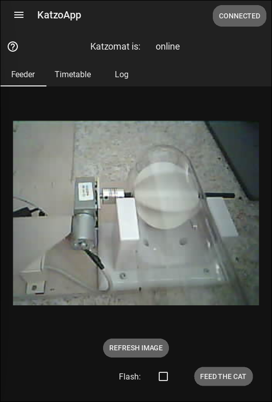
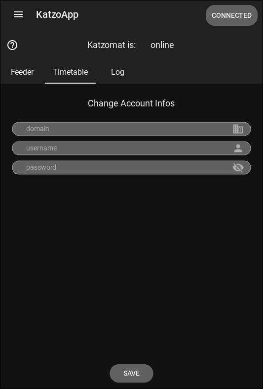
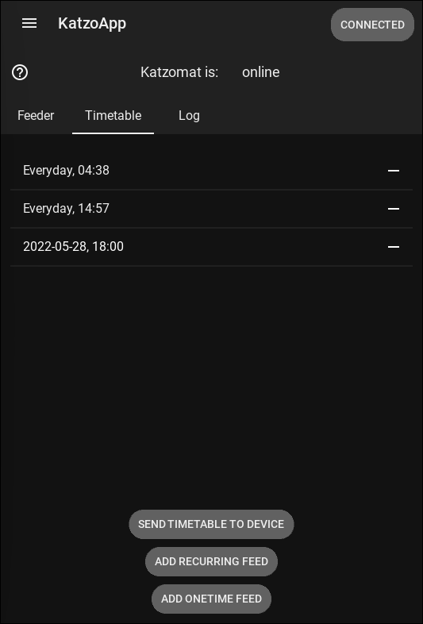
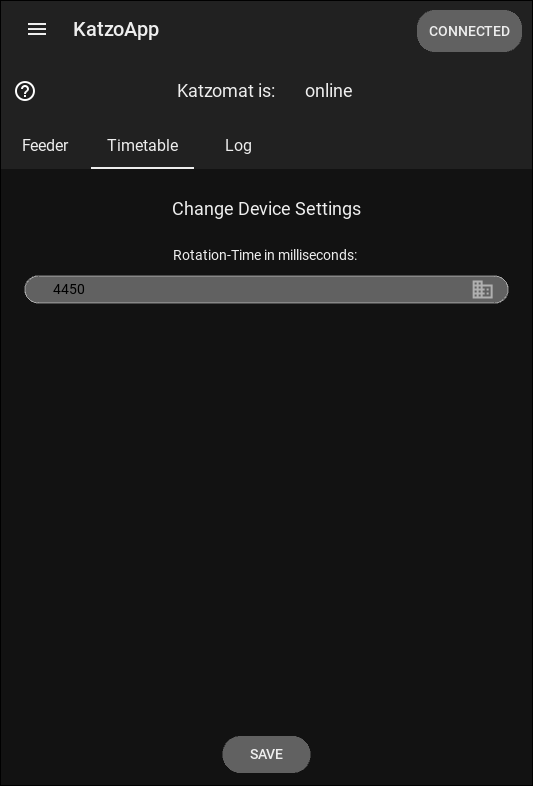
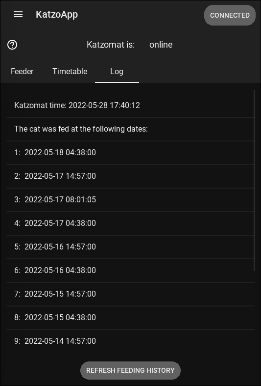
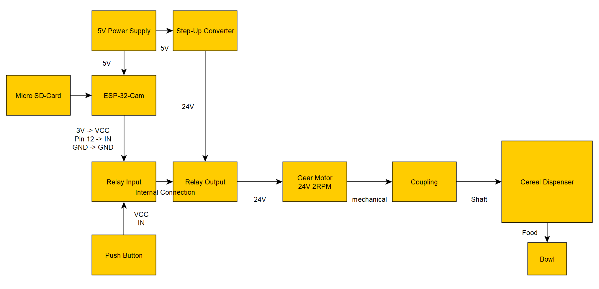
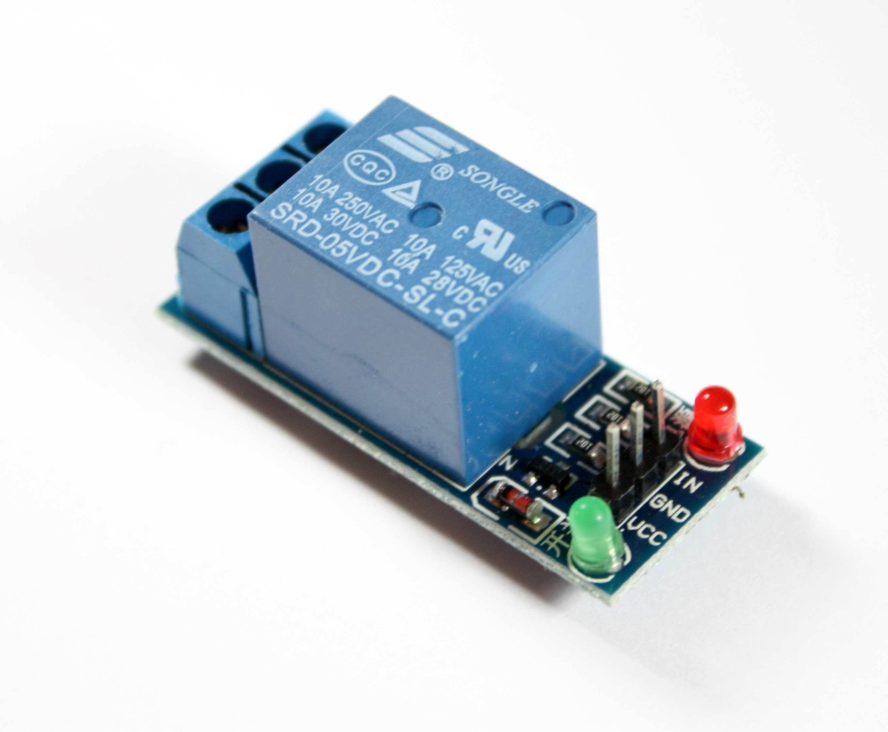
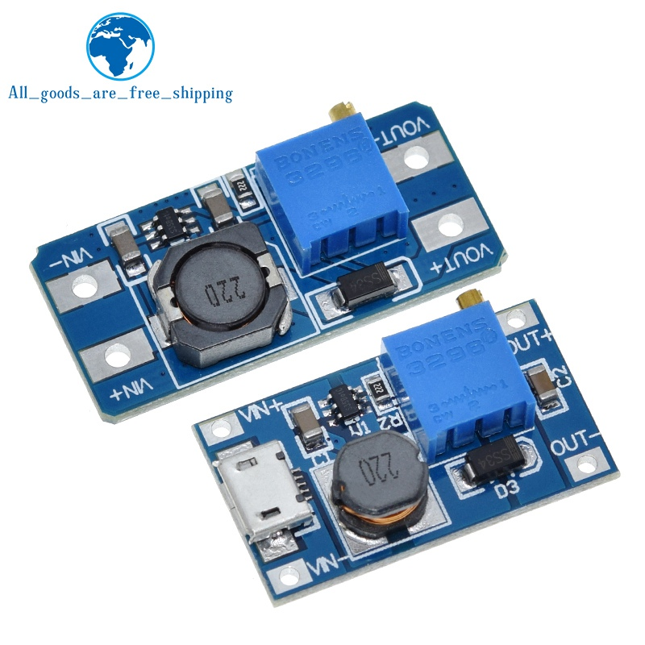
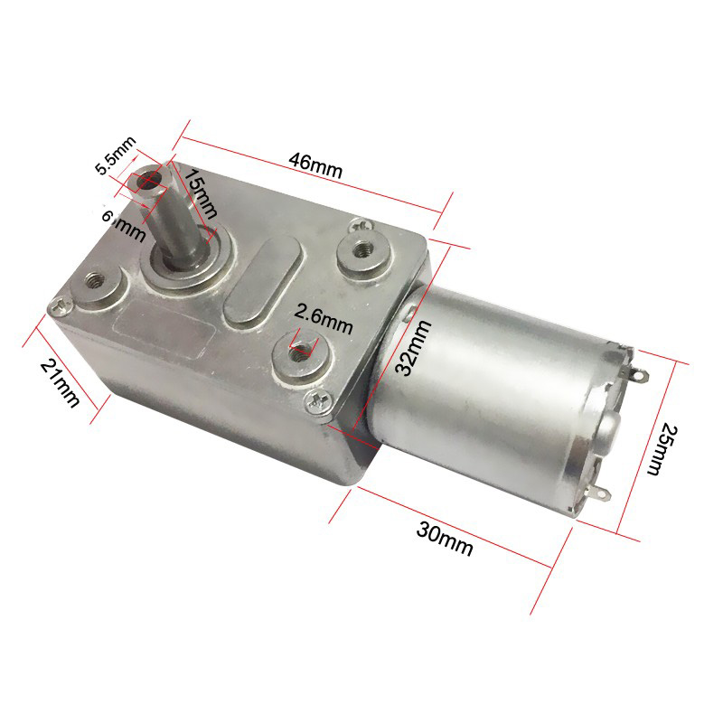
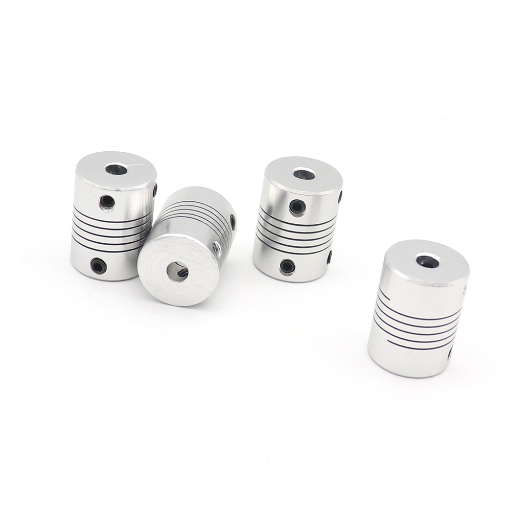

# Katzomat - IoT pet feeding device
Control your pets feeding schedule while you are away/sleeping/working... just take your mind off of it. 
There are three components to this System:
1. A MQTT broker is the central communication hub, so it should run on a dedicated server.
2. The feeding device 'Katzomat', that is controlled by a microcontroller, in this case a ESP-32-CAM, which is a MQTT client.
3. The mobile software 'Katzo-app', that is used to setup the feeding schedule and check in on your cat's eating habbit by taking images. Its also a MQTT client

### How does the App work?
The App connects to a MQTT broker that holds all the relevant information about the Katzomat.
e.g. feeding schedule, status (online/offline), latest image of the feeding bowl, history of feeding.

### What User Data is saved, and where?
Locally stored data on the app:             feeding schedule, last image, Katzomat settings, user credentials. 
Locally stored data on the microcontroller: feeding schedule, last image, Katzomat settings, user credentials. 
Online stored data on the MQTT broker:      feeding schedule, last image, Katzomat settings.

### Is my data save?
The network transmission is ssl encrypted. Local data on the mobile device is encrypted using the pyAesCrypt library. 
Its certainly possible to setup your own MQTT broker, if you don't trust others with your data. A tutorial on that is in planning.

### Is this software cross-platform?
Yes. It is written in python and kivy/kivyMD. Its possible to compile with buildozer for Android, iOS and also possible to compile for desktop usage.

### How to use App?
The App tries to connect to the MQTT broker on startup. Access the main screens "Feeder", 'Timetable' and 'Log' from the Tab bar. Settings can be accessed via the the menu ribbon top left. 
Request a still image from the Katzomat or feed the pet directly. 

 
Account Settings: If you use the app the first time or want to change user data you can change the MQTT domain, username and password here.  

 
Timetable: Overview of the feeding schedule. To setup a feeding timetable, you can select either a recurring or once occuring feeding schedule. 

 
Device Settings: Here you can adjust things like turning time of the feeding motor. 

 
Log: See the feeding history and current time on the device. 

 
### How do I know it actually works? 
The microcontroller has a camera so you can see if the feeding worked and if your pet did in fact eat anything. Request a still image at any time.

### Do I need a permanent internet connection for this to work?
No. The microcontroller saves the schedule on an SD-Card. The App sends its data to a MQTT broker and when the microcontroller comes online again, it receives all the latest information and vice versa.

### Can this be used for something else, like watering plants?
Yes. You would have to make some changes to how the actual mechanics work, but other than that it should be quit easy to adapt this to do something else.

### What kind of technologies are used?
This is an IoT (Internet of Things) project. So it uses the MQTT protocol to communicate between the clients (e.g. the feeding device and the App) to remote control a device via the Internet. 
The App is written in Python and Kivy/KivyMD. The microcontroller is an ESP32 that is programmed c/c++.

### How are the components wired/build together?
Look over this fine schematic: 

 

### What do I need to build a Katzomat
You will need a series of components, that are mostely readily available. The only thing that is kind of special is the shaft connecting the motor with the food dispenser. I will upload a 3D file soon. Cost should be around 40€. 

1. Some kind of Cereal Dispenser of this type. 

 

2. ESP32-CAM and a compatible programmer. 

 

3. 5V or 3V Relais Modul. 

 

4. DC-DC Step Up Converter: 5V to 24V 

 

5. Worm Gear Motor 24V 2rpm or something similar. 

 

6. Flexible Coupling for the Motor and Shaft from 6mm to 8mm since the motor shaft diameter and the dispenser shaft diameter are different. 

 

